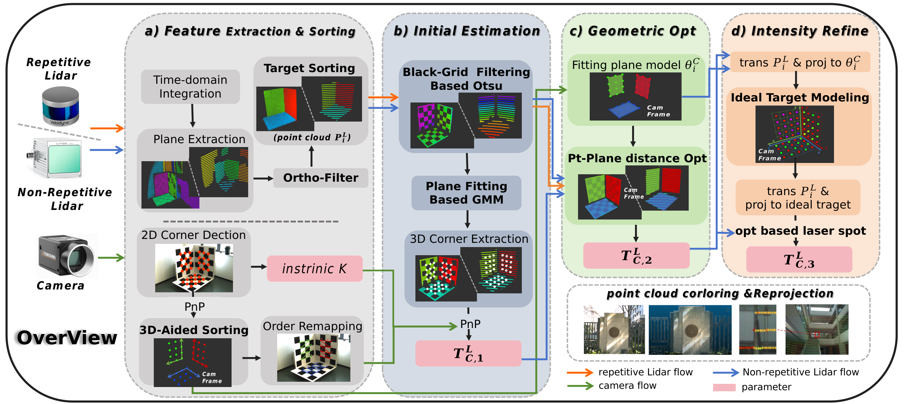
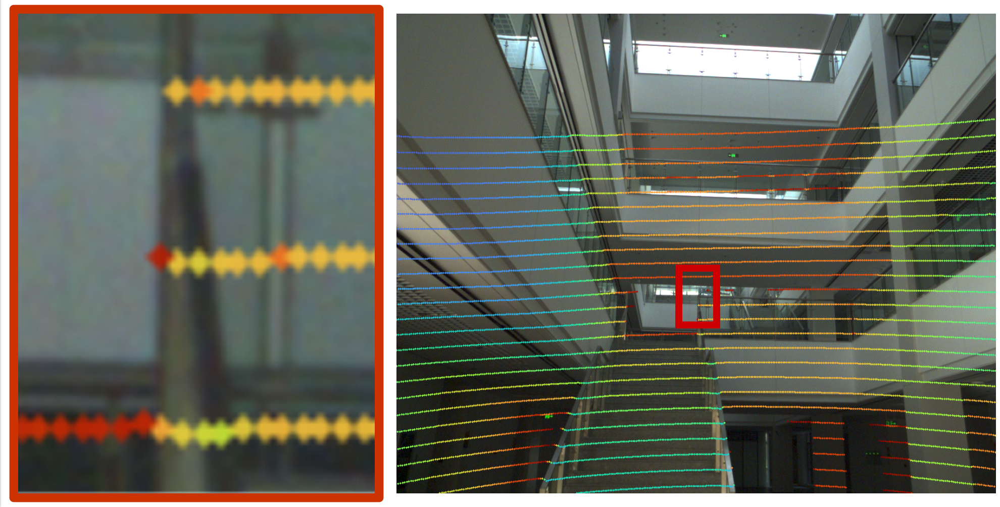
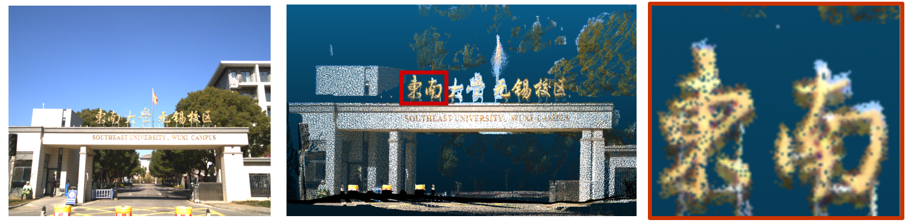

# Universal LiDAR-Camera Calibration

This repository contains the source code for the paper:

**Universal LiDAR-camera extrinsic calibration with relaxed orthogonality and laser spot model using 3D checkerboard**

We provide a universal and automated extrinsic calibration framework via a 3D checkerboard. The method supports both non-repetitive scanning LiDARs, such as Livox, and repetitive scanning LiDARs, such as Velodyne.

## Overview

The proposed framework extracts and sorts 3D checkerboard features from LiDAR point clouds and 2D checkerboard corners from camera images, estimates an initial transformation, and refines the extrinsic calibration through geometric optimization and laser spot modeling.



## Results

### Repetitive Scanning LiDAR

Example projection/coloring result for repetitive scanning LiDAR calibration:



### Non-Repetitive Scanning LiDAR

Example projection/coloring result for non-repetitive scanning LiDAR calibration:



## Quick Start

### 1. Pull Docker Image

```bash
docker pull zerobing12/cali_gdb
```

### 2. Create and Enter Docker Container

Run the provided script from the repository root:

```bash
./docker_cali.sh
```

The script will create a Docker container named `uni_cali` if it does not already exist, mount the current repository into the container, and enter the calibration workspace.

### 3. Build Dependencies

Inside the Docker container, compile the third-party libraries first:

```bash
./build_env.sh
```

### 4. Build Project

After the dependencies are compiled, build the calibration project:

```bash
./build.sh
```

## Run Calibration

### Repetitive Scanning LiDAR

For repetitive scanning LiDARs, such as Velodyne, run:

```bash
./start_MSR.sh
```

### Non-Repetitive Scanning LiDAR

For non-repetitive scanning LiDARs, such as Livox, run:

```bash
./start_SSR.sh
```

During calibration, the current calibration status can be visualized in real time with RViz.

## Notes

- Make sure Docker is installed and running before executing `./docker_cali.sh`.
- The Docker script enables X11 forwarding for RViz visualization.
- Run all build and calibration commands from the repository root inside the Docker container.

## Citation

If you find this project useful in your research, please consider citing our paper.
